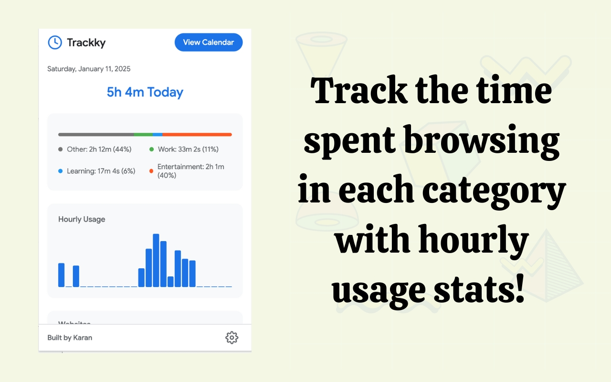
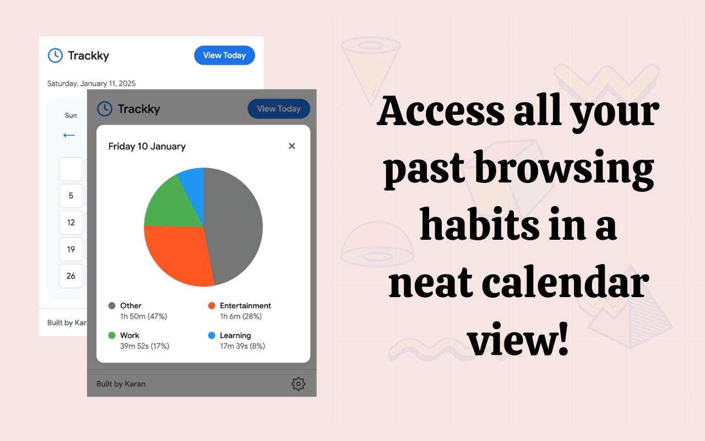
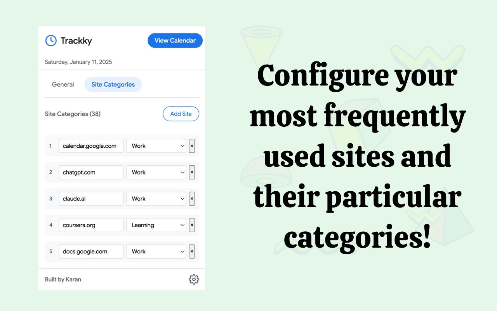

# Trackky - Super Time Tracker

  <strong>Track, record and visualize your daily web activity with incredible detail 🚀</strong>

Trackky is a privacy-focused browser extension that helps you understand how you spend your time online. With a beautiful, Material Design-inspired interface and powerful features, Trackky makes time tracking both insightful and delightful.

## ✨ Features

- **Real-time Tracking**: Automatically tracks your browsing time across different websites
- **Beautiful Dashboard**: Clean, modern interface showing your daily web activity
- **Smart Categories**: Automatically categorizes websites into Work, Entertainment, Learning, and more
- **Detailed Analytics**: View your browsing patterns with:
  - Daily summaries
  - Hourly breakdowns
  - Category-based insights
  - Monthly calendar view
- **Customizable Categories**: Easily add and modify website categories
- **Privacy First**: All data stays local on your device - no external servers or tracking
- **Calendar View**: Visualize your browsing patterns over time
- **Lightweight**: Minimal impact on browser performance

## 🖼️ Screenshots

## 🚀 Installation

1. Clone this repository or download the ZIP file
2. Open Chrome and navigate to `chrome://extensions/`
3. Enable "Developer mode" in the top right
4. Click "Load unpacked" and select the `trackky` folder
5. The extension icon should appear in your browser toolbar

## 🛠️ Development

Want to contribute? Great! Here's how to set up the development environment:

1. Fork the repository
2. Clone your fork:
    `git clone https://github.com/yourusername/trackky.git`
3. Make your changes
4. Test the extension locally
5. Submit a pull request

## 🤝 Contributing

Contributions are what make the open source community such an amazing place to learn, inspire, and create. Any contributions you make are **greatly appreciated**.

1. Fork the Project
2. Create your Feature Branch (`git checkout -b feature/AmazingFeature`)
3. Commit your Changes (`git commit -m 'Add some AmazingFeature'`)
4. Push to the Branch (`git push origin feature/AmazingFeature`)
5. Open a Pull Request

## 📝 License

Distributed under the MIT License. See `LICENSE` for more information.

## 🌟 Show your support

Give a ⭐️ if this project helped you!

## 🙏 Acknowledgments

- Google Material Design for inspiration
- Myself

---